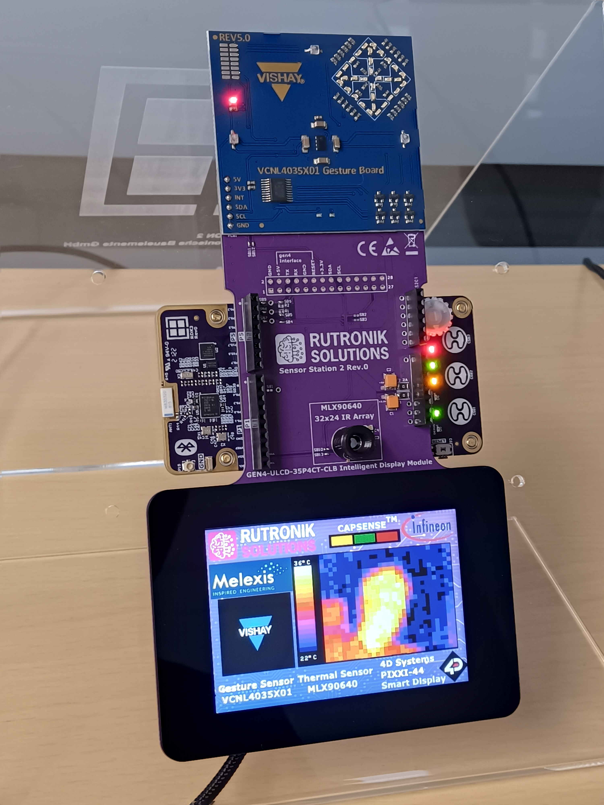

# Sensor Station 2 Application

This is a demonstration of the sensors MLX90640 [thermal camera], VCNL4035X01 [gesture control], and the smart display GEN4-ULCD-35P4CT-CLB. Everything is connected to the main controller - **RDK3** board.

## Requirements

- [ModusToolbox&trade; software](https://www.infineon.com/modustoolbox) v3.0 or later (tested with v3.0)

   

## Legal Disclaimer

The evaluation board including the software is for testing purposes only and, because it has limited functions and limited resilience, is not suitable for permanent use under real conditions. If the evaluation board is nevertheless used under real conditions, this is done at one’s responsibility; any liability of Rutronik is insofar excluded. 

